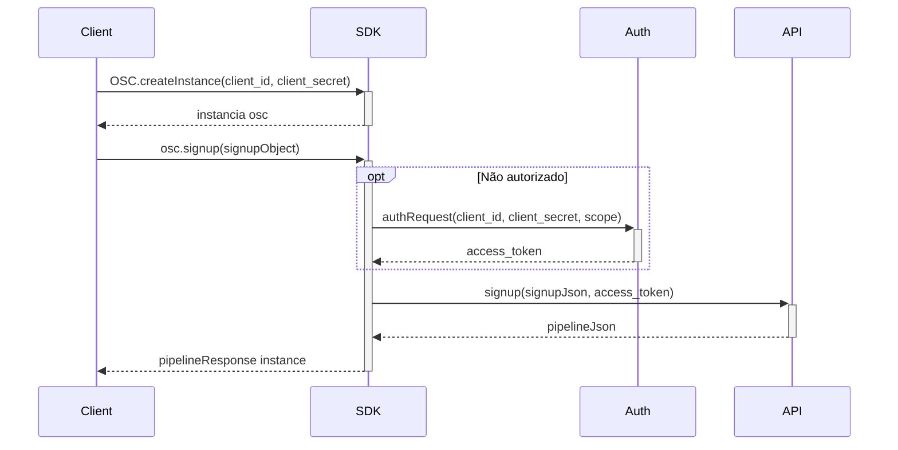
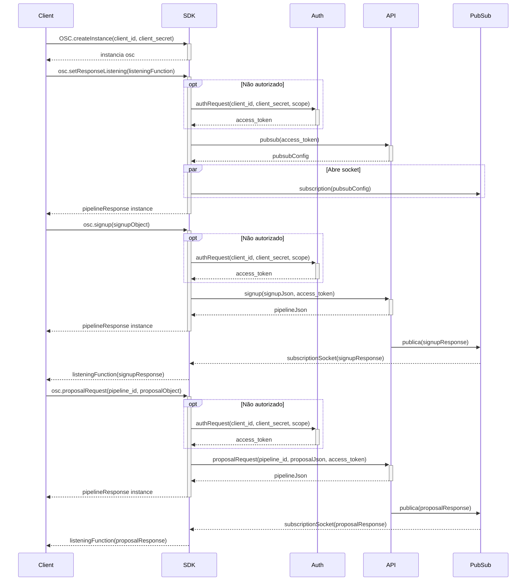
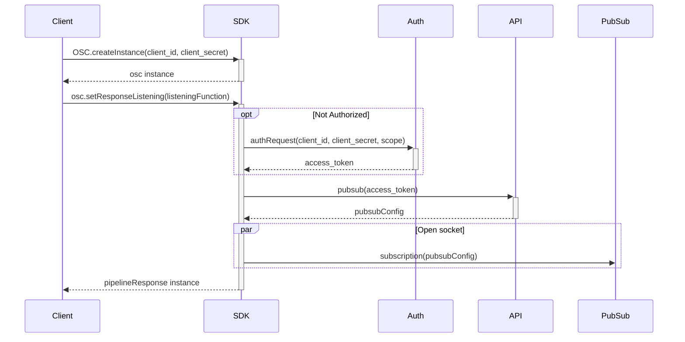
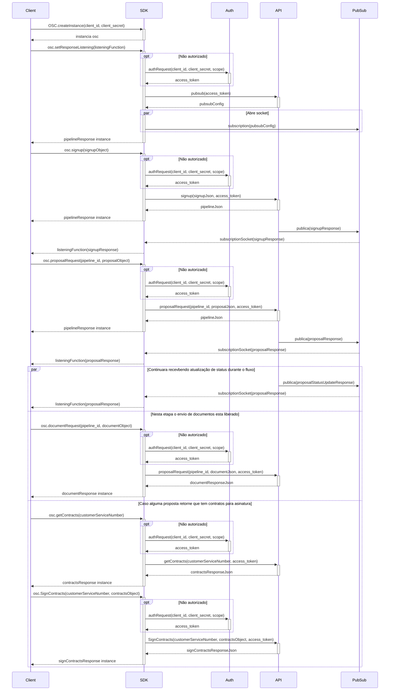

## Getting Started

Welcome to the OSC SDK JAVA project.

## Folder Structure

The workspace contains two folders by default, where:

- `./src/main/java`: the folder to maintain sources
- `./src/test/java`: the folder to maintain tests
- `./gradle`: gradle wraper

for the subfolders, it is divided into the following structure:

- `./Requests`: This is the Integration layer, here you will find all the requests to external APIs;
- `./Utils`: This is the support layer, here you will find the methods that are used to help and/or clean the overall code from the SDK;
- `./src`: This is the Enumeration and Domain layer, here you will find the Objects and Enums that the SDK utilizes throughout its code structure;

<b>
<details>
<summary>Complete folder structure:</summary>
📦src <br>
 ┣ 📂main <br>
 ┃ ┗ 📂java <br>
 ┃ ┃ ┗ 📂br <br>
 ┃ ┃ ┃ ┗ 📂com <br>
 ┃ ┃ ┃ ┃ ┗ 📂fitbank <br>
 ┃ ┃ ┃ ┃ ┃ ┣ 📂domains <br>
 ┃ ┃ ┃ ┃ ┃ ┃ ┣ 📜AccountType.java <br>
 ┃ ┃ ┃ ┃ ┃ ┃ ┣ 📜Address.java <br>
 ┃ ┃ ┃ ┃ ┃ ┃ ┣ 📜Auth.java <br>
 ┃ ┃ ┃ ┃ ┃ ┃ ┣ 📜AuthSucess.java <br>
 ┃ ┃ ┃ ┃ ┃ ┃ ┣ 📜Auto.java <br>
 ┃ ┃ ┃ ┃ ┃ ┃ ┣ 📜Bank.java <br>
 ┃ ┃ ┃ ┃ ┃ ┃ ┣ 📜BankAccount.java <br>
 ┃ ┃ ┃ ┃ ┃ ┃ ┣ 📜Banks.java <br>
 ┃ ┃ ┃ ┃ ┃ ┃ ┣ 📜BorrowerInfo.java <br>
 ┃ ┃ ┃ ┃ ┃ ┃ ┣ 📜Business.java <br>
 ┃ ┃ ┃ ┃ ┃ ┃ ┣ 📜Card.java <br>
 ┃ ┃ ┃ ┃ ┃ ┃ ┣ 📜City.java <br>
 ┃ ┃ ┃ ┃ ┃ ┃ ┣ 📜ConsumerUnit.java <br>
 ┃ ┃ ┃ ┃ ┃ ┃ ┣ 📜SignContractRequest.java <br>
 ┃ ┃ ┃ ┃ ┃ ┃ ┣ 📜Credit.java <br>
 ┃ ┃ ┃ ┃ ┃ ┃ ┣ 📜CreditCardBenefits.java <br>
 ┃ ┃ ┃ ┃ ┃ ┃ ┣ 📜CreditStatus.java <br>
 ┃ ┃ ┃ ┃ ┃ ┃ ┣ 📜Document.java <br>
 ┃ ┃ ┃ ┃ ┃ ┃ ┣ 📜DocumentResponse.java <br>
 ┃ ┃ ┃ ┃ ┃ ┃ ┣ 📜DocumentType.java <br>
 ┃ ┃ ┃ ┃ ┃ ┃ ┣ 📜Education.java <br>
 ┃ ┃ ┃ ┃ ┃ ┃ ┣ 📜EmploymentSince.java <br>
 ┃ ┃ ┃ ┃ ┃ ┃ ┣ 📜Error.java <br>
 ┃ ┃ ┃ ┃ ┃ ┃ ┣ 📜ErrorField.java <br>
 ┃ ┃ ┃ ┃ ┃ ┃ ┣ 📜ErrorFields.java <br>
 ┃ ┃ ┃ ┃ ┃ ┃ ┣ 📜Gender.java <br>
 ┃ ┃ ┃ ┃ ┃ ┃ ┣ 📜Home.java <br>
 ┃ ┃ ┃ ┃ ┃ ┃ ┣ 📜HomeSince.java <br>
 ┃ ┃ ┃ ┃ ┃ ┃ ┣ 📜HomeType.java <br>
 ┃ ┃ ┃ ┃ ┃ ┃ ┣ 📜Identity.java <br>
 ┃ ┃ ┃ ┃ ┃ ┃ ┣ 📜IdentityIssuer.java <br>
 ┃ ┃ ┃ ┃ ┃ ┃ ┣ 📜IdentityType.java <br>
 ┃ ┃ ┃ ┃ ┃ ┃ ┣ 📜Loan.java <br>
 ┃ ┃ ┃ ┃ ┃ ┃ ┣ 📜LoanObjectives.java <br>
 ┃ ┃ ┃ ┃ ┃ ┃ ┣ 📜LogData.java <br>
 ┃ ┃ ┃ ┃ ┃ ┃ ┣ 📜Match.java <br>
 ┃ ┃ ┃ ┃ ┃ ┃ ┣ 📜MatchAuto.java <br>
 ┃ ┃ ┃ ┃ ┃ ┃ ┣ 📜MatchCard.java <br>
 ┃ ┃ ┃ ┃ ┃ ┃ ┣ 📜MatchHome.java <br>
 ┃ ┃ ┃ ┃ ┃ ┃ ┣ 📜MatchLoan.java <br>
 ┃ ┃ ┃ ┃ ┃ ┃ ┣ 📜MimeType.java <br>
 ┃ ┃ ┃ ┃ ┃ ┃ ┣ 📜Nationality.java <br>
 ┃ ┃ ┃ ┃ ┃ ┃ ┣ 📜Network.java <br>
 ┃ ┃ ┃ ┃ ┃ ┃ ┣ 📜Occupation.java <br>
 ┃ ┃ ┃ ┃ ┃ ┃ ┣ 📜PendentDocuments.java <br>
 ┃ ┃ ┃ ┃ ┃ ┃ ┣ 📜Pipeline.java <br>
 ┃ ┃ ┃ ┃ ┃ ┃ ┣ 📜PipelineExpire.java <br>
 ┃ ┃ ┃ ┃ ┃ ┃ ┣ 📜PipelineMatchLoan.java <br>
 ┃ ┃ ┃ ┃ ┃ ┃ ┣ 📜PipelineProposal.java <br>
 ┃ ┃ ┃ ┃ ┃ ┃ ┣ 📜PipelineWithBankAccountProposal.java <br>
 ┃ ┃ ┃ ┃ ┃ ┃ ┣ 📜PipelineWithProposal.java <br>
 ┃ ┃ ┃ ┃ ┃ ┃ ┣ 📜Product.java <br>
 ┃ ┃ ┃ ┃ ┃ ┃ ┣ 📜ProductAuto.java <br>
 ┃ ┃ ┃ ┃ ┃ ┃ ┣ 📜ProductBankAccount.java <br>
 ┃ ┃ ┃ ┃ ┃ ┃ ┣ 📜ProductCard.java <br>
 ┃ ┃ ┃ ┃ ┃ ┃ ┣ 📜ProductHome.java <br>
 ┃ ┃ ┃ ┃ ┃ ┃ ┣ 📜ProductLoan.java <br>
 ┃ ┃ ┃ ┃ ┃ ┃ ┣ 📜Products.java <br>
 ┃ ┃ ┃ ┃ ┃ ┃ ┣ 📜ProductType.java <br>
 ┃ ┃ ┃ ┃ ┃ ┃ ┣ 📜Profession.java <br>
 ┃ ┃ ┃ ┃ ┃ ┃ ┣ 📜Proposal.java <br>
 ┃ ┃ ┃ ┃ ┃ ┃ ┣ 📜ProposalBankAccount.java <br>
 ┃ ┃ ┃ ┃ ┃ ┃ ┣ 📜Proposals.java <br>
 ┃ ┃ ┃ ┃ ┃ ┃ ┣ 📜PubSubRequestReturn.java <br>
 ┃ ┃ ┃ ┃ ┃ ┃ ┣ 📜RealEstateType.java <br>
 ┃ ┃ ┃ ┃ ┃ ┃ ┣ 📜Reference.java <br>
 ┃ ┃ ┃ ┃ ┃ ┃ ┣ 📜RelationshipStatus.java <br>
 ┃ ┃ ┃ ┃ ┃ ┃ ┣ 📜SignContract.java <br>
 ┃ ┃ ┃ ┃ ┃ ┃ ┣ 📜SignupMatch.java <br>
 ┃ ┃ ┃ ┃ ┃ ┃ ┣ 📜SimpleSignup.java <br>
 ┃ ┃ ┃ ┃ ┃ ┃ ┣ 📜State.java <br>
 ┃ ┃ ┃ ┃ ┃ ┃ ┗ 📜Vehicle.java <br>
 ┃ ┃ ┃ ┃ ┃ ┣ 📂requests <br>
 ┃ ┃ ┃ ┃ ┃ ┃ ┣ 📜OAuth.java <br>
 ┃ ┃ ┃ ┃ ┃ ┃ ┣ 📜PubSubRequest.java <br>
 ┃ ┃ ┃ ┃ ┃ ┃ ┣ 📜PubSubSubscription.java <br>
 ┃ ┃ ┃ ┃ ┃ ┃ ┗ 📜Signup.java <br>
 ┃ ┃ ┃ ┃ ┃ ┣ 📂utils <br>
 ┃ ┃ ┃ ┃ ┃ ┃ ┣ 📜InstantDeSerializer.java <br>
 ┃ ┃ ┃ ┃ ┃ ┃ ┗ 📜JSON.java <br>
 ┃ ┃ ┃ ┃ ┃ ┗ 📜OSC.java <br>
 ┗ 📂test <br>
 ┃ ┗ 📂java <br>
 ┃ ┃ ┗ 📂br <br>
 ┃ ┃ ┃ ┗ 📂com <br>
 ┃ ┃ ┃ ┃ ┗ 📂fitbank <br>
 ┃ ┃ ┃ ┃ ┃ ┣ 📂domains <br>
 ┃ ┃ ┃ ┃ ┃ ┃ ┣ 📜AddressTest.java <br>
 ┃ ┃ ┃ ┃ ┃ ┃ ┣ 📜AuthSucessTest.java <br>
 ┃ ┃ ┃ ┃ ┃ ┃ ┣ 📜AuthTest.java <br>
 ┃ ┃ ┃ ┃ ┃ ┃ ┣ 📜AutoTest.java <br>
 ┃ ┃ ┃ ┃ ┃ ┃ ┣ 📜BankAccountTest.java <br>
 ┃ ┃ ┃ ┃ ┃ ┃ ┣ 📜BankTest.java <br>
 ┃ ┃ ┃ ┃ ┃ ┃ ┣ 📜BorrowerInfoTest.java <br>
 ┃ ┃ ┃ ┃ ┃ ┃ ┣ 📜BusinessTest.java <br>
 ┃ ┃ ┃ ┃ ┃ ┃ ┣ 📜CardTest.java <br>
 ┃ ┃ ┃ ┃ ┃ ┃ ┣ 📜CityTest.java <br>
 ┃ ┃ ┃ ┃ ┃ ┃ ┣ 📜ConsumerUnitTest.java <br>
 ┃ ┃ ┃ ┃ ┃ ┃ ┣ 📜ContractTest.java <br>
 ┃ ┃ ┃ ┃ ┃ ┃ ┣ 📜CreditTest.java <br>
 ┃ ┃ ┃ ┃ ┃ ┃ ┣ 📜DocumentResponseTest.java <br>
 ┃ ┃ ┃ ┃ ┃ ┃ ┣ 📜DocumentTest.java <br>
 ┃ ┃ ┃ ┃ ┃ ┃ ┣ 📜ErrorFieldsTest.java <br>
 ┃ ┃ ┃ ┃ ┃ ┃ ┣ 📜ErrorFieldTest.java <br>
 ┃ ┃ ┃ ┃ ┃ ┃ ┣ 📜HomeTest.java <br>
 ┃ ┃ ┃ ┃ ┃ ┃ ┣ 📜IdentityTest.java <br>
 ┃ ┃ ┃ ┃ ┃ ┃ ┣ 📜LoanTest.java <br>
 ┃ ┃ ┃ ┃ ┃ ┃ ┣ 📜LogDataTest.java <br>
 ┃ ┃ ┃ ┃ ┃ ┃ ┣ 📜MatchAutoTest.java <br>
 ┃ ┃ ┃ ┃ ┃ ┃ ┣ 📜MatchCardTest.java <br>
 ┃ ┃ ┃ ┃ ┃ ┃ ┣ 📜MatchHomeTest.java <br>
 ┃ ┃ ┃ ┃ ┃ ┃ ┣ 📜MatchLoanTest.java <br>
 ┃ ┃ ┃ ┃ ┃ ┃ ┣ 📜MatchTest.java <br>
 ┃ ┃ ┃ ┃ ┃ ┃ ┣ 📜PipelineExpireTest.java <br>
 ┃ ┃ ┃ ┃ ┃ ┃ ┣ 📜PipelineMatchLoanTest.java <br>
 ┃ ┃ ┃ ┃ ┃ ┃ ┣ 📜PipelineProposalTest.java <br>
 ┃ ┃ ┃ ┃ ┃ ┃ ┣ 📜PipelineTest.java <br>
 ┃ ┃ ┃ ┃ ┃ ┃ ┣ 📜PipelineWithBankAccountProposalTest.java <br>
 ┃ ┃ ┃ ┃ ┃ ┃ ┣ 📜PipelineWithProposalTest.java <br>
 ┃ ┃ ┃ ┃ ┃ ┃ ┣ 📜ProductAutoTest.java <br>
 ┃ ┃ ┃ ┃ ┃ ┃ ┣ 📜ProductBankAccountTest.java <br>
 ┃ ┃ ┃ ┃ ┃ ┃ ┣ 📜ProductCardTest.java <br>
 ┃ ┃ ┃ ┃ ┃ ┃ ┣ 📜ProductHomeTest.java <br>
 ┃ ┃ ┃ ┃ ┃ ┃ ┣ 📜ProductLoanTest.java <br>
 ┃ ┃ ┃ ┃ ┃ ┃ ┣ 📜ProductsTest.java <br>
 ┃ ┃ ┃ ┃ ┃ ┃ ┣ 📜ProductTest.java <br>
 ┃ ┃ ┃ ┃ ┃ ┃ ┣ 📜ProposalBankAccountTest.java <br>
 ┃ ┃ ┃ ┃ ┃ ┃ ┣ 📜ProposalsTest.java <br>
 ┃ ┃ ┃ ┃ ┃ ┃ ┣ 📜ProposalTest.java <br>
 ┃ ┃ ┃ ┃ ┃ ┃ ┣ 📜ReferenceTest.java <br>
 ┃ ┃ ┃ ┃ ┃ ┃ ┣ 📜SignContractTest.java <br>
 ┃ ┃ ┃ ┃ ┃ ┃ ┣ 📜SignupMatchTest.java <br>
 ┃ ┃ ┃ ┃ ┃ ┃ ┣ 📜SimpleSignupTest.java <br>
 ┃ ┃ ┃ ┃ ┃ ┃ ┗ 📜VehicleTest.java <br>
 ┃ ┃ ┃ ┃ ┃ ┣ 📂requests <br>
 ┃ ┃ ┃ ┃ ┃ ┃ ┣ 📜OAuthTest.java <br>
 ┃ ┃ ┃ ┃ ┃ ┃ ┣ 📜PubSubRequestTest.java <br>
 ┃ ┃ ┃ ┃ ┃ ┃ ┣ 📜PubSubSubscriptionTest.java <br>
 ┃ ┃ ┃ ┃ ┃ ┃ ┗ 📜SignupTest.java <br>
 ┃ ┃ ┃ ┃ ┃ ┗ 📜OSCTest.java <br>
</details>
</b>

## To test project
- `./gradlew test`

## EndPoints

- [x] `OAuth` - Creation of an authentication token to access the EndPoints. Result in a `AuthSucess`.
- [x] `Document` - Send a Document to analyses. Result in a `DocumentResponse`.
- [x] `Proposal` / `SimpleProposal` - Use the data to create proposals. Result in a `PipelineProposal`.
- [x] `PubSubRequest` - Get TopicID and ProjectID to a `PubSubSubscription`. Result in a `PubSubResponse`.
- [x] `PubsubSubscription` - Use the `PubSubRequest` data to create a listener and process mensages. 
- [x] `Signup` / `SimpleSignup`  - Make a SignUp for or get access users . Result in a `SignupResponse`.
- [x] `GetContract` - Get a signContractRequest to a respective proposalRequest to sign. Result in a `GetContract`.
- [x] `PostContract` - Send a signed signContractRequest for a respective proposalRequest.
- [x] `OSC` - Create OSC instances.

## Usability examples

### Signup
#### Flowchart


#### Code
```Java
public class Signup {
    
    public Pipeline signup(String client_id, String client_secret, String client_Data) {
        try {
            
            OSC osc = OSC.createIntance(client_id, client_secret);
            SignupMatch signupRequest = JSON.getGson().fromJson(client_Data, SignupMatch.class);
            return Signup.request(osc, signupRequest);
            
        } catch (RuntimeException | IOException e) {
            e.printStackTrace();
            assertNull(e);
        }
    }
}
```
### Signup + Proposal
#### Flowchart

#### Code
```Java
public class SignupProposal {
    
    public Pipeline signupSuccessTest(String client_id, String client_secret, String client_Data) {
        try {
            
            OSC osc = OSC.createIntance(client_id, client_secret);
            SignupMatch signupRequest = JSON.getGson().fromJson(client_Data, SignupMatch.class);
            return Signup.request(osc, signupRequest);
            
        } catch (RuntimeException | IOException e) {
            e.printStackTrace();
            assertNull(e);
        }
    }
    
    public Pipeline proposalRequest(String client_id, String client_secret, Pipeline pipelineResponse, String proposal_Data){
        try {
            OSC osc = OSC.createIntance(client_id, client_secret);
            Proposal proposalRequest = JSON.getGson().fromJson(proposal_Data, Proposal.class);
            return br.com.fitbank.requests.Proposal.request(osc, proposalRequest, pipelineResponse.getID);
            
        } catch (RuntimeException | IOException e) {
            e.printStackTrace();
            assertNull(e);
        }
    }
}
```
### PubSub
#### Flowchart

#### Code
```Java
public class PubSub {
   
    public pubSubRequestReturn Request(String client_id, String client_secret) {
        try {
            OSC osc = OSC.createIntance(client_id, client_secret);
            return PubSubRequest.request(osc);
            
        } catch (RuntimeException | IOException e) {
            e.printStackTrace();
            assertNull(e);
        }
    }
    public void listener() throws IOException, InterruptedException {
        MessageReceiver receiver =
                (PubsubMessage message, AckReplyConsumer consumer) -> {
                    System.out.println("Id: " + message.getMessageId());
                    System.out.println("Data: " + message.getData().toStringUtf8());
                    consumer.ack();
                };

        PubSubSubscription.subscriber("project-5341349585364433217", "callback-leonardo.sousa-sub", receiver);
        TimeUnit.SECONDS.sleep(30);
    }
}
```
### Fluxo completo
#### Flowchart

#### Code
```Java
public class CompleteExemple {
    static OSC osc;

    public static void main(String[] args) {
        String client_id = "";
        String client_secret = "";
        osc = OSC.createIntance(client_id, client_secret);

        try {
            osc.setResponseListening(CompleteExemple::processPipelineResult);
            PipelineResponse pipelineResponse = signup();
            processPipelineResult(pipelineResponse);

        } catch (IOException | InterruptedException e) {
            e.printStackTrace();
        }
    }

    public static void processPipelineResult(PipelineResponse pipelineResponse) throws IOException {
        if (pipelineResponse == null) {
            System.out.println("Pipeline: error");
            return;
        }

        switch (pipelineResponse.getStatus()) {
            case SIGNUP_ANALISIS -> System.out.println("Pipeline: " + pipelineResponse.getId() + " (cadastro em analise)");
            case SIGNUP_COMPLETED -> {
                System.out.println("Pipeline: " + pipelineResponse.getId() + " (enviar solicitação de proposta)");
                proposal(pipelineResponse.getId());
            }
            case SIGNUP_DENIED -> System.out.println("Pipeline: " + pipelineResponse.getId() + " (cadastro reprovado)");
            case PROPOSAL_ANALISIS -> System.out.println("Pipeline: " + pipelineResponse.getId() + " (proposta em analise)");
            case PROPOSAL_CREATED -> {
                System.out.println("Pipeline: " + pipelineResponse.getId() + " (proposta(s) criadas)");

                Proposals[] proposals = pipelineResponse.getProposals();
                boolean pendentDoc = true;

                for (Proposals p : proposals) {
                    if (p != null) {
                        if (p.getHasDocuments()) {
                            DocumentRequest documentRequest = null;
                            for (PendentDocuments pendentDocument : p.getPendentDocuments()) {
                                switch (pendentDocument) {

                                    case SELF:
                                        documentRequest = new DocumentRequest(DocumentType.SELF, MimeType.CODE_01, "name", "base 64");
                                        break;
                                    case ADDRESS_PROOF:
                                        documentRequest = new DocumentRequest(DocumentType.ADDRESS_PROOF, MimeType.CODE_01, "name", "base 64");
                                        break;
                                    case IDENTITY_BACK:
                                        documentRequest = new DocumentRequest(DocumentType.IDENTITY_BACK, MimeType.CODE_01, "name", "base 64");
                                        break;
                                    case IDENTITY_FRONT:
                                        documentRequest = new DocumentRequest(DocumentType.IDENTITY_FRONT, MimeType.CODE_01, "name", "base 64");
                                        break;
                                    case INCOME_PROOF:
                                        documentRequest = new DocumentRequest(DocumentType.INCOME_PROOF, MimeType.CODE_01, "name", "base 64");
                                        break;
                                }
                                br.com.fitbank.requests.Document.putDocument(osc, documentRequest, pipelineResponse.getId());
                            }
                        } else {
                            pendentDoc = false;
                        }
                    }

                    if (!pendentDoc) {
                        if (p != null) {
                            if (p.getHasContracts()) {
                                SignContractRequest signContractRequest = null;//contrato
                                String customServiceNumber = null;

                                SignContractResponse s = postContract(osc, customServiceNumber, signContractRequest);
                                String signContracts[] = new String[]{s.getAceptedCheckSum()};

                                SignContractRequest signedSignContractRequest = new SignContractRequest(signContracts, null);
                                postContract(osc, customServiceNumber, signedSignContractRequest);
                            }
                        }
                    }
                }
            }
            case PROPOSAL_DENIED -> System.out.println("Pipeline: " + pipelineResponse.getId() + " (proposta reprovada)");
            default -> System.out.println("Pipeline: " + pipelineResponse.getId());
        }
    }

    public static PipelineResponse signup() throws IOException {
        String data = "";
        SignupRequest signupRequest = JSON.getGson().fromJson(data, SignupRequest.class);
        return OSC.getIntance().signup(signupRequest);
    }

    public static PipelineResponse proposal(String id) throws IOException {
        String data = "";
        ProposalRequest proposalRequest = JSON.getGson().fromJson(data, ProposalRequest.class);
        return OSC.getIntance().proposal(proposalRequest, id);
    }
}
```
## References

1. https://developers.easycredito.com.br/
2. https://docs.gradle.org/current/userguide/getting_started.html
3. https://junit.org/junit5/docs/current/user-guide/
4. https://github.com/google/gson

## Other Projects:

1. https://github.com/Fitbank-Pagamentos-Eletronicos/osc-sdk-csharp
2. https://github.com/Fitbank-Pagamentos-Eletronicos/osc-sdk-nodejs
3. https://github.com/Fitbank-Pagamentos-Eletronicos/osc-sdk-python
4. https://github.com/Fitbank-Pagamentos-Eletronicos/osc-sdk-go
