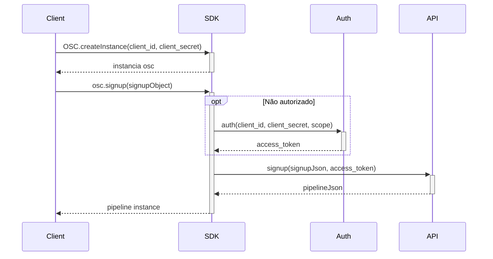
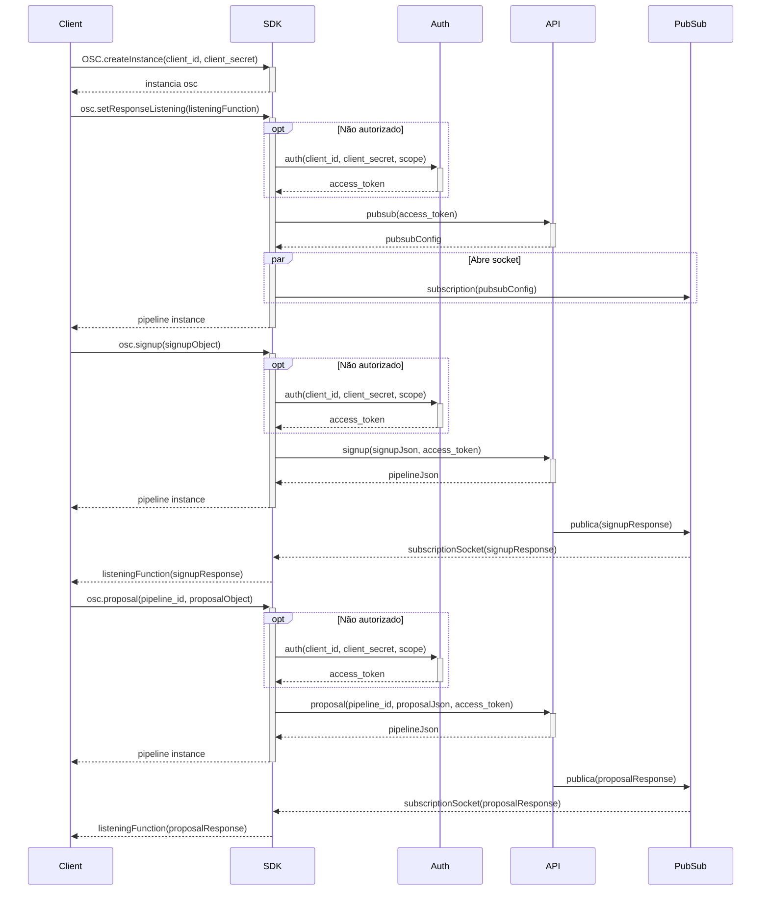
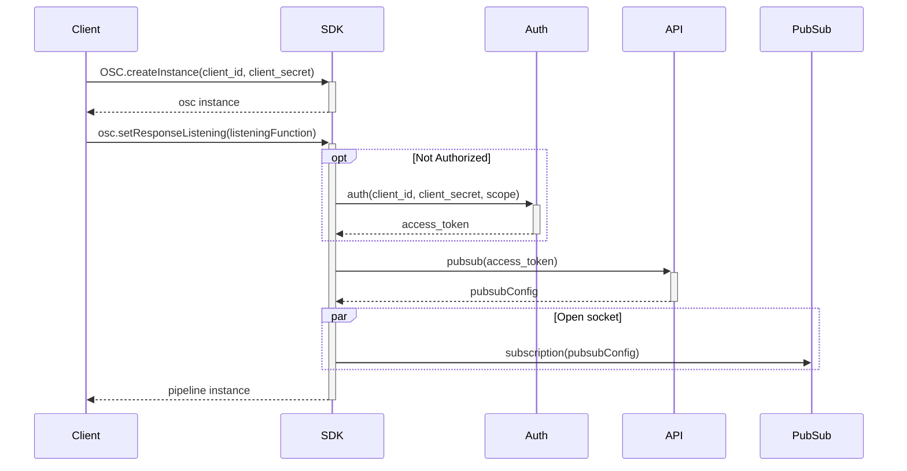
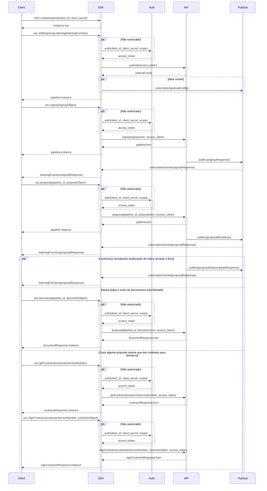

## Getting Started

Welcome to the OSC SDK JAVA project.

## Folder Structure

The workspace contains two folders by default, where:

- `./src/main/java`: the folder to maintain sources
- `./src/test/java`: the folder to maintain tests
- `./gradle`: gradle wraper

for the subfolders, it is divided into the following structure:

- `./Requests`: This is the Integration layer, here you will find all the requests to external APIs;
- `./Utils`: This is the support layer, here you will find the methods that are used to help and/or clean the overall code from the SDK;
- `./src`: This is the Enumeration and Domain layer, here you will find the Objects and Enums that the SDK utilizes throughout its code structure;

<b>
<details>
<summary>Complete folder structure:</summary>
📦src <br>
 ┣ 📂main <br>
 ┃ ┗ 📂java <br>
 ┃ ┃ ┗ 📂br <br>
 ┃ ┃ ┃ ┗ 📂com <br>
 ┃ ┃ ┃ ┃ ┗ 📂fitbank <br>
 ┃ ┃ ┃ ┃ ┃ ┣ 📂domains <br>
 ┃ ┃ ┃ ┃ ┃ ┃ ┣ 📜AccountType.java <br>
 ┃ ┃ ┃ ┃ ┃ ┃ ┣ 📜Address.java <br>
 ┃ ┃ ┃ ┃ ┃ ┃ ┣ 📜Auth.java <br>
 ┃ ┃ ┃ ┃ ┃ ┃ ┣ 📜AuthSucess.java <br>
 ┃ ┃ ┃ ┃ ┃ ┃ ┣ 📜Auto.java <br>
 ┃ ┃ ┃ ┃ ┃ ┃ ┣ 📜Bank.java <br>
 ┃ ┃ ┃ ┃ ┃ ┃ ┣ 📜BankAccount.java <br>
 ┃ ┃ ┃ ┃ ┃ ┃ ┣ 📜Banks.java <br>
 ┃ ┃ ┃ ┃ ┃ ┃ ┣ 📜BorrowerInfo.java <br>
 ┃ ┃ ┃ ┃ ┃ ┃ ┣ 📜Business.java <br>
 ┃ ┃ ┃ ┃ ┃ ┃ ┣ 📜Card.java <br>
 ┃ ┃ ┃ ┃ ┃ ┃ ┣ 📜City.java <br>
 ┃ ┃ ┃ ┃ ┃ ┃ ┣ 📜ConsumerUnit.java <br>
 ┃ ┃ ┃ ┃ ┃ ┃ ┣ 📜Contract.java <br>
 ┃ ┃ ┃ ┃ ┃ ┃ ┣ 📜Credit.java <br>
 ┃ ┃ ┃ ┃ ┃ ┃ ┣ 📜CreditCardBenefits.java <br>
 ┃ ┃ ┃ ┃ ┃ ┃ ┣ 📜CreditStatus.java <br>
 ┃ ┃ ┃ ┃ ┃ ┃ ┣ 📜Document.java <br>
 ┃ ┃ ┃ ┃ ┃ ┃ ┣ 📜DocumentResponse.java <br>
 ┃ ┃ ┃ ┃ ┃ ┃ ┣ 📜DocumentType.java <br>
 ┃ ┃ ┃ ┃ ┃ ┃ ┣ 📜Education.java <br>
 ┃ ┃ ┃ ┃ ┃ ┃ ┣ 📜EmploymentSince.java <br>
 ┃ ┃ ┃ ┃ ┃ ┃ ┣ 📜Error.java <br>
 ┃ ┃ ┃ ┃ ┃ ┃ ┣ 📜ErrorField.java <br>
 ┃ ┃ ┃ ┃ ┃ ┃ ┣ 📜ErrorFields.java <br>
 ┃ ┃ ┃ ┃ ┃ ┃ ┣ 📜Gender.java <br>
 ┃ ┃ ┃ ┃ ┃ ┃ ┣ 📜Home.java <br>
 ┃ ┃ ┃ ┃ ┃ ┃ ┣ 📜HomeSince.java <br>
 ┃ ┃ ┃ ┃ ┃ ┃ ┣ 📜HomeType.java <br>
 ┃ ┃ ┃ ┃ ┃ ┃ ┣ 📜Identity.java <br>
 ┃ ┃ ┃ ┃ ┃ ┃ ┣ 📜IdentityIssuer.java <br>
 ┃ ┃ ┃ ┃ ┃ ┃ ┣ 📜IdentityType.java <br>
 ┃ ┃ ┃ ┃ ┃ ┃ ┣ 📜Loan.java <br>
 ┃ ┃ ┃ ┃ ┃ ┃ ┣ 📜LoanObjectives.java <br>
 ┃ ┃ ┃ ┃ ┃ ┃ ┣ 📜LogData.java <br>
 ┃ ┃ ┃ ┃ ┃ ┃ ┣ 📜Match.java <br>
 ┃ ┃ ┃ ┃ ┃ ┃ ┣ 📜MatchAuto.java <br>
 ┃ ┃ ┃ ┃ ┃ ┃ ┣ 📜MatchCard.java <br>
 ┃ ┃ ┃ ┃ ┃ ┃ ┣ 📜MatchHome.java <br>
 ┃ ┃ ┃ ┃ ┃ ┃ ┣ 📜MatchLoan.java <br>
 ┃ ┃ ┃ ┃ ┃ ┃ ┣ 📜MimeType.java <br>
 ┃ ┃ ┃ ┃ ┃ ┃ ┣ 📜Nationality.java <br>
 ┃ ┃ ┃ ┃ ┃ ┃ ┣ 📜Network.java <br>
 ┃ ┃ ┃ ┃ ┃ ┃ ┣ 📜Occupation.java <br>
 ┃ ┃ ┃ ┃ ┃ ┃ ┣ 📜PendentDocuments.java <br>
 ┃ ┃ ┃ ┃ ┃ ┃ ┣ 📜Pipeline.java <br>
 ┃ ┃ ┃ ┃ ┃ ┃ ┣ 📜PipelineExpire.java <br>
 ┃ ┃ ┃ ┃ ┃ ┃ ┣ 📜PipelineMatchLoan.java <br>
 ┃ ┃ ┃ ┃ ┃ ┃ ┣ 📜PipelineProposal.java <br>
 ┃ ┃ ┃ ┃ ┃ ┃ ┣ 📜PipelineWithBankAccountProposal.java <br>
 ┃ ┃ ┃ ┃ ┃ ┃ ┣ 📜PipelineWithProposal.java <br>
 ┃ ┃ ┃ ┃ ┃ ┃ ┣ 📜Product.java <br>
 ┃ ┃ ┃ ┃ ┃ ┃ ┣ 📜ProductAuto.java <br>
 ┃ ┃ ┃ ┃ ┃ ┃ ┣ 📜ProductBankAccount.java <br>
 ┃ ┃ ┃ ┃ ┃ ┃ ┣ 📜ProductCard.java <br>
 ┃ ┃ ┃ ┃ ┃ ┃ ┣ 📜ProductHome.java <br>
 ┃ ┃ ┃ ┃ ┃ ┃ ┣ 📜ProductLoan.java <br>
 ┃ ┃ ┃ ┃ ┃ ┃ ┣ 📜Products.java <br>
 ┃ ┃ ┃ ┃ ┃ ┃ ┣ 📜ProductType.java <br>
 ┃ ┃ ┃ ┃ ┃ ┃ ┣ 📜Profession.java <br>
 ┃ ┃ ┃ ┃ ┃ ┃ ┣ 📜Proposal.java <br>
 ┃ ┃ ┃ ┃ ┃ ┃ ┣ 📜ProposalBankAccount.java <br>
 ┃ ┃ ┃ ┃ ┃ ┃ ┣ 📜Proposals.java <br>
 ┃ ┃ ┃ ┃ ┃ ┃ ┣ 📜PubSubRequestReturn.java <br>
 ┃ ┃ ┃ ┃ ┃ ┃ ┣ 📜RealEstateType.java <br>
 ┃ ┃ ┃ ┃ ┃ ┃ ┣ 📜Reference.java <br>
 ┃ ┃ ┃ ┃ ┃ ┃ ┣ 📜RelationshipStatus.java <br>
 ┃ ┃ ┃ ┃ ┃ ┃ ┣ 📜SignContract.java <br>
 ┃ ┃ ┃ ┃ ┃ ┃ ┣ 📜SignupMatch.java <br>
 ┃ ┃ ┃ ┃ ┃ ┃ ┣ 📜SimpleSignup.java <br>
 ┃ ┃ ┃ ┃ ┃ ┃ ┣ 📜State.java <br>
 ┃ ┃ ┃ ┃ ┃ ┃ ┗ 📜Vehicle.java <br>
 ┃ ┃ ┃ ┃ ┃ ┣ 📂requests <br>
 ┃ ┃ ┃ ┃ ┃ ┃ ┣ 📜OAuth.java <br>
 ┃ ┃ ┃ ┃ ┃ ┃ ┣ 📜PubSubRequest.java <br>
 ┃ ┃ ┃ ┃ ┃ ┃ ┣ 📜PubSubSubscription.java <br>
 ┃ ┃ ┃ ┃ ┃ ┃ ┗ 📜Signup.java <br>
 ┃ ┃ ┃ ┃ ┃ ┣ 📂utils <br>
 ┃ ┃ ┃ ┃ ┃ ┃ ┣ 📜InstantDeSerializer.java <br>
 ┃ ┃ ┃ ┃ ┃ ┃ ┗ 📜JSON.java <br>
 ┃ ┃ ┃ ┃ ┃ ┗ 📜OSC.java <br>
 ┗ 📂test <br>
 ┃ ┗ 📂java <br>
 ┃ ┃ ┗ 📂br <br>
 ┃ ┃ ┃ ┗ 📂com <br>
 ┃ ┃ ┃ ┃ ┗ 📂fitbank <br>
 ┃ ┃ ┃ ┃ ┃ ┣ 📂domains <br>
 ┃ ┃ ┃ ┃ ┃ ┃ ┣ 📜AddressTest.java <br>
 ┃ ┃ ┃ ┃ ┃ ┃ ┣ 📜AuthSucessTest.java <br>
 ┃ ┃ ┃ ┃ ┃ ┃ ┣ 📜AuthTest.java <br>
 ┃ ┃ ┃ ┃ ┃ ┃ ┣ 📜AutoTest.java <br>
 ┃ ┃ ┃ ┃ ┃ ┃ ┣ 📜BankAccountTest.java <br>
 ┃ ┃ ┃ ┃ ┃ ┃ ┣ 📜BankTest.java <br>
 ┃ ┃ ┃ ┃ ┃ ┃ ┣ 📜BorrowerInfoTest.java <br>
 ┃ ┃ ┃ ┃ ┃ ┃ ┣ 📜BusinessTest.java <br>
 ┃ ┃ ┃ ┃ ┃ ┃ ┣ 📜CardTest.java <br>
 ┃ ┃ ┃ ┃ ┃ ┃ ┣ 📜CityTest.java <br>
 ┃ ┃ ┃ ┃ ┃ ┃ ┣ 📜ConsumerUnitTest.java <br>
 ┃ ┃ ┃ ┃ ┃ ┃ ┣ 📜ContractTest.java <br>
 ┃ ┃ ┃ ┃ ┃ ┃ ┣ 📜CreditTest.java <br>
 ┃ ┃ ┃ ┃ ┃ ┃ ┣ 📜DocumentResponseTest.java <br>
 ┃ ┃ ┃ ┃ ┃ ┃ ┣ 📜DocumentTest.java <br>
 ┃ ┃ ┃ ┃ ┃ ┃ ┣ 📜ErrorFieldsTest.java <br>
 ┃ ┃ ┃ ┃ ┃ ┃ ┣ 📜ErrorFieldTest.java <br>
 ┃ ┃ ┃ ┃ ┃ ┃ ┣ 📜HomeTest.java <br>
 ┃ ┃ ┃ ┃ ┃ ┃ ┣ 📜IdentityTest.java <br>
 ┃ ┃ ┃ ┃ ┃ ┃ ┣ 📜LoanTest.java <br>
 ┃ ┃ ┃ ┃ ┃ ┃ ┣ 📜LogDataTest.java <br>
 ┃ ┃ ┃ ┃ ┃ ┃ ┣ 📜MatchAutoTest.java <br>
 ┃ ┃ ┃ ┃ ┃ ┃ ┣ 📜MatchCardTest.java <br>
 ┃ ┃ ┃ ┃ ┃ ┃ ┣ 📜MatchHomeTest.java <br>
 ┃ ┃ ┃ ┃ ┃ ┃ ┣ 📜MatchLoanTest.java <br>
 ┃ ┃ ┃ ┃ ┃ ┃ ┣ 📜MatchTest.java <br>
 ┃ ┃ ┃ ┃ ┃ ┃ ┣ 📜PipelineExpireTest.java <br>
 ┃ ┃ ┃ ┃ ┃ ┃ ┣ 📜PipelineMatchLoanTest.java <br>
 ┃ ┃ ┃ ┃ ┃ ┃ ┣ 📜PipelineProposalTest.java <br>
 ┃ ┃ ┃ ┃ ┃ ┃ ┣ 📜PipelineTest.java <br>
 ┃ ┃ ┃ ┃ ┃ ┃ ┣ 📜PipelineWithBankAccountProposalTest.java <br>
 ┃ ┃ ┃ ┃ ┃ ┃ ┣ 📜PipelineWithProposalTest.java <br>
 ┃ ┃ ┃ ┃ ┃ ┃ ┣ 📜ProductAutoTest.java <br>
 ┃ ┃ ┃ ┃ ┃ ┃ ┣ 📜ProductBankAccountTest.java <br>
 ┃ ┃ ┃ ┃ ┃ ┃ ┣ 📜ProductCardTest.java <br>
 ┃ ┃ ┃ ┃ ┃ ┃ ┣ 📜ProductHomeTest.java <br>
 ┃ ┃ ┃ ┃ ┃ ┃ ┣ 📜ProductLoanTest.java <br>
 ┃ ┃ ┃ ┃ ┃ ┃ ┣ 📜ProductsTest.java <br>
 ┃ ┃ ┃ ┃ ┃ ┃ ┣ 📜ProductTest.java <br>
 ┃ ┃ ┃ ┃ ┃ ┃ ┣ 📜ProposalBankAccountTest.java <br>
 ┃ ┃ ┃ ┃ ┃ ┃ ┣ 📜ProposalsTest.java <br>
 ┃ ┃ ┃ ┃ ┃ ┃ ┣ 📜ProposalTest.java <br>
 ┃ ┃ ┃ ┃ ┃ ┃ ┣ 📜ReferenceTest.java <br>
 ┃ ┃ ┃ ┃ ┃ ┃ ┣ 📜SignContractTest.java <br>
 ┃ ┃ ┃ ┃ ┃ ┃ ┣ 📜SignupMatchTest.java <br>
 ┃ ┃ ┃ ┃ ┃ ┃ ┣ 📜SimpleSignupTest.java <br>
 ┃ ┃ ┃ ┃ ┃ ┃ ┗ 📜VehicleTest.java <br>
 ┃ ┃ ┃ ┃ ┃ ┣ 📂requests <br>
 ┃ ┃ ┃ ┃ ┃ ┃ ┣ 📜OAuthTest.java <br>
 ┃ ┃ ┃ ┃ ┃ ┃ ┣ 📜PubSubRequestTest.java <br>
 ┃ ┃ ┃ ┃ ┃ ┃ ┣ 📜PubSubSubscriptionTest.java <br>
 ┃ ┃ ┃ ┃ ┃ ┃ ┗ 📜SignupTest.java <br>
 ┃ ┃ ┃ ┃ ┃ ┗ 📜OSCTest.java <br>
</details>
</b>

## To test project
- `./gradlew test`

## EndPoints

- [x] `OAuth` - Creation of an authentication token to access the EndPoints. Result in a `AuthSucess`.
- [x] `Document` - Send a Document to analyses. Result in a `DocumentResponse`.
- [x] `Proposal` / `SimpleProposal` - Use the data to create proposals. Result in a `PipelineProposal`.
- [x] `PubSubRequest` - Get TopicID and ProjectID to a `PubSubSubscription`. Result in a `PubSubResponse`.
- [x] `PubsubSubscription` - Use the `PubSubRequest` data to create a listener and process mensages. 
- [x] `Signup` / `SimpleSignup`  - Make a SignUp for or get access users . Result in a `SignupResponse`.
- [x] `GetContract` - Get a contract to a respective proposal to sign. Result in a `GetContract`.
- [x] `PostContract` - Send a signed contract for a respective proposal.
- [x] `OSC` - Create OSC instances.

## Usability examples

### Signup
#### Flowchart


#### Code
```Java
public class Signup {
    
    public Pipeline signup(String client_id, String client_secret, String client_Data) {
        try {
            
            OSC osc = OSC.createIntance(client_id, client_secret);
            SignupMatch signupMatch = JSON.getGson().fromJson(client_Data, SignupMatch.class);
            return Signup.request(osc, signupMatch);
            
        } catch (RuntimeException | IOException e) {
            e.printStackTrace();
            assertNull(e);
        }
    }
}
```
### Signup + Proposal
#### Flowchart

#### Code
```Java
public class SignupProposal {
    
    public Pipeline signupSuccessTest(String client_id, String client_secret, String client_Data) {
        try {
            
            OSC osc = OSC.createIntance(client_id, client_secret);
            SignupMatch signupMatch = JSON.getGson().fromJson(client_Data, SignupMatch.class);
            return Signup.request(osc, signupMatch);
            
        } catch (RuntimeException | IOException e) {
            e.printStackTrace();
            assertNull(e);
        }
    }
    
    public Pipeline proposal(String client_id, String client_secret, Pipeline pipeline, String proposal_Data){
        try {
            OSC osc = OSC.createIntance(client_id, client_secret);
            Proposal proposal = JSON.getGson().fromJson(proposal_Data, Proposal.class);
            return br.com.fitbank.requests.Proposal.request(osc, proposal, pipeline.getID);
            
        } catch (RuntimeException | IOException e) {
            e.printStackTrace();
            assertNull(e);
        }
    }
}
```
### PubSub
#### Flowchart

#### Code
```Java
public class PubSub {
   
    public pubSubRequestReturn Request(String client_id, String client_secret) {
        try {
            OSC osc = OSC.createIntance(client_id, client_secret);
            return PubSubRequest.request(osc);
            
        } catch (RuntimeException | IOException e) {
            e.printStackTrace();
            assertNull(e);
        }
    }
    public void listener() throws IOException, InterruptedException {
        MessageReceiver receiver =
                (PubsubMessage message, AckReplyConsumer consumer) -> {
                    System.out.println("Id: " + message.getMessageId());
                    System.out.println("Data: " + message.getData().toStringUtf8());
                    consumer.ack();
                };

        PubSubSubscription.subscriber("project-5341349585364433217", "callback-leonardo.sousa-sub", receiver);
        TimeUnit.SECONDS.sleep(30);
    }
}
```
### Fluxo completo
#### Flowchart

#### Code
```Java
public class SignupProposal {
    
    public Pipeline signupSuccessTest(String client_id, String client_secret, String client_Data) {
        try {
            
            OSC osc = OSC.createIntance(client_id, client_secret);
            SignupMatch signupMatch = JSON.getGson().fromJson(client_Data, SignupMatch.class);
            return Signup.request(osc, signupMatch);
            
        } catch (RuntimeException | IOException e) {
            e.printStackTrace();
            assertNull(e);
        }
    }
    

        public pubSubRequestReturn Request(String client_id, String client_secret) {
            try {
                OSC osc = OSC.createIntance(client_id, client_secret);
                return PubSubRequest.request(osc);

            } catch (RuntimeException | IOException e) {
                e.printStackTrace();
                assertNull(e);
            }
        }
    public Pipeline proposal(String client_id, String client_secret, Pipeline pipeline, String proposal_Data){
        try {
            OSC osc = OSC.createIntance(client_id, client_secret);
            Proposal proposal = JSON.getGson().fromJson(proposal_Data, Proposal.class);
            return br.com.fitbank.requests.Proposal.request(osc, proposal, pipeline.getID);
            
        } catch (RuntimeException | IOException e) {
            e.printStackTrace();
            assertNull(e);
        }
    }

    public void listener() throws IOException, InterruptedException {
        MessageReceiver receiver =
                (PubsubMessage message, AckReplyConsumer consumer) -> {
                    System.out.println("Id: " + message.getMessageId());
                    System.out.println("Data: " + message.getData().toStringUtf8());
                    consumer.ack();
                };
    
        PubSubSubscription.subscriber("project-5341349585364433217", "callback-leonardo.sousa-sub", receiver);
        TimeUnit.SECONDS.sleep(30);
    }

    public documentResponse Document(String client_id, String client_secret, Pipeline pipeline,String Document) throws IOException {
        try {
            osc = OSC.createIntance(client_id, client_secret);
            br.com.fitbank.domains.Document document = JSON.getGson().fromJson(Document, br.com.fitbank.domains.Document.class);

            DocumentResponse documentResponse = br.com.fitbank.requests.Document.putDocument(osc, document, pipeline_id);
            return documentResponse;
        } catch (RuntimeException | IOException e) {
            e.printStackTrace();
            assertNull(e);
        }
    }
    public br.com.fitbank.domains.GetContract getContractTest(String client_id, String client_secret) {
        try {
            osc = OSC.createIntance(client_id, client_secret);
            
            GetContract getContract = JSON.getGson().fromJson(s, GetContract.class);
            br.com.fitbank.domains.GetContract getContract1 = br.com.fitbank.requests.GetContract.GetContract (osc, System.getenv("CUSTOM_SERVICE_NUMBER"));
            return getContract1;
        } catch (RuntimeException | IOException e) {
            e.printStackTrace();
            assertNull(e);
        }
    }
    public br.com.fitbank.domains.SignContract getContractTest(String client_id, String client_secret, String Contract) {

        try {
            osc = OSC.createIntance(client_id, client_secret);

            br.com.fitbank.domains.Contract Contract = JSON.getGson().fromJson(Contract, br.com.fitbank.domains.Contract.class);
            br.com.fitbank.domains.SignContract signContract = br.com.fitbank.requests.PostContract.postContract (osc, System.getenv("CUSTOM_SERVICE_NUMBER"),Contract);
            return signContract;
        } catch (RuntimeException | IOException e) {
            e.printStackTrace();
            assertNull(e);
        }
    }
}
```
## References

1. https://developers.easycredito.com.br/
2. https://docs.gradle.org/current/userguide/getting_started.html
3. https://junit.org/junit5/docs/current/user-guide/
4. https://github.com/google/gson